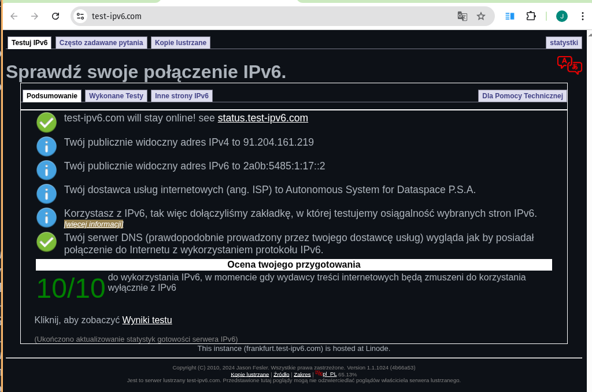

## 1) instalacja OpenVPN

```sh
apt-get install openvpn
```

## 2) Konfiguracja OpenVPN jako serwer 

Użyłem [skryptu instalacyjnego, który prowadzi przez instalację OpenVPN](https://github.com/angristan/openvpn-install). Ma ponad 15k gwiazdek, co jakoś go uwiarygadnia. Ustawia wiele opcji, które poprawiają bezpieczeństwo i nie są domyślnymi wyborami w OpenVPN, m. in.
* wymusza TLS >= 1.2

Skrypt zarządza kluczami i certyfikatami przy pomocy *easy-rsa*.

### a) z kluczami SSL do autoryzacji

Skyrpt automatycznie generuje klucze i umieszcza w katalogu `/etc/openvpn`.

### b) używając nazw użytkownika do autoryzacji

Paczka `openvpn` na Debianie dostarcza plugin, którego można użyć:
```sh
dpkg -L openvpn | grep pam
```

Opis można znaleźć w `README.auth-pam` z powyższego polecenia.

Dodajemy plugin do konfiguracji `/etc/openvpn/server.conf`:

```sh
# other config options here
plugin /usr/lib/openvpn/plugins/openvpn-plugin-auth-pam.so openvpn-pam
```
`openvpn-pam` to nazwa serwisu PAM, którego będziemy używać

Następnie konfigurujemy `/etc/pam.d/openvpm-pam`. Może to być np. link symboliczny do `/etc/pam.d/login`.


## 3) Skonfiguruj OpenVPN na laptopie

Wystarczy skopiować plik konfiguracyjny utworzony przez skrypt na laptopa, np.
```sh
rsync ii339630@prask4:/home/ii339630/laptop-dell.ovpn .
```
i uruchomić klienta OpenVPN:
```sh
sudo openvpn --config ./laptop-dell
```

## 4) WireGuard

Jest [analogiczny skrypt instalacyjny dla WireGuard](https://github.com/angristan/wireguard-install).

Skrypt daje możliwość utworzenia klienta i wypluwa zarówno konfigurację w pliku, jak i kod QR w terminalu.

Można sprawdzić status usługi poleceniem
```sh
systemctl status wg-quick@wg0
```

### Konfiguracja klienta

```sh
sudo apt install wireguard
rsync ii339630@prask4:/home/ii339630/wg-client-laptop-dell.conf wg0.conf
wg-quick up ./wg0.conf
```

Wyłączenie:
```sh
wg-quick down ./wg0.conf
```

## 5) Obsługa IPv6

Skrypt instalacyjny OpenVPN automatycznie ustawia obsługę IPv6 i dostaje 10/10 na stronie. Nie jest to (jeśli dobrze rozumiem) tunelowanie "teredo".



Wireguard zainstalowany przy pomocy skryptu też daje 10/10.

---

NDP Proxy do zrobienia VPN na IPv6
